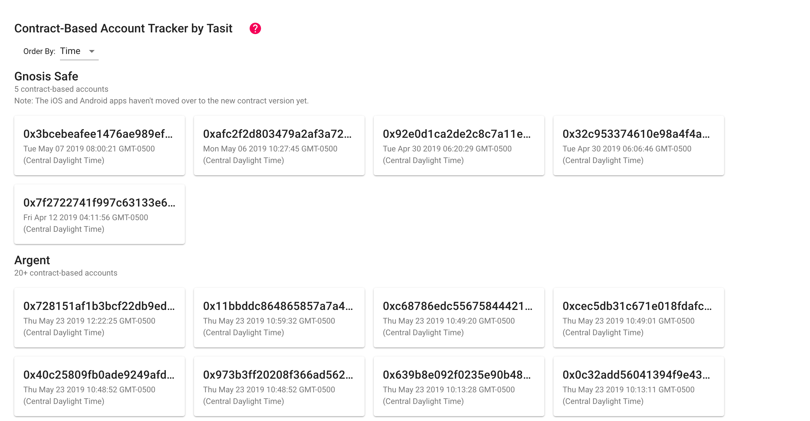

# Gnosis Safe Subgraph

This subgraph indexes new deployments of contract-based accounts for users of the Gnosis Safe.

There's a UI that uses this subgraph at [contractbasedaccounts.com](https://contractbasedaccounts.com).

<div align="left">
  
</div>

For more information see the [Gnosis Safe docs](https://gnosis-safe.readthedocs.io/en/latest/) and/or the [docs for The Graph](https://thegraph.com/docs/).

We've also built a related subgraph, the [Argent subgraph](https://github.com/tasitlabs/argent-subgraph).

### Why is this interesting?

Well, for example [this contract-based account](https://etherscan.io/address/0xafc2f2d803479a2af3a72022d54cc0901a0ec0d6) has 5,000 ETH in it.

### Schema

```graphql
type ContractBasedAccount @entity {
  id: ID!
  timeCreated: BigInt!
}
```

### Sample query

Get the two most recent Gnosis Safe contract-based accounts, with the newest one shown first.

```graphql
{
  contractBasedAccounts(first: 2, orderBy: timeCreated, orderDirection: desc) {
    id
    timeCreated
  }
}
```

### Sample response

```json
{
  "data": {
    "contractBasedAccounts": [
      {
        "id": "0x3bcebeafee1476ae989ef108c2c825ad3be7a38b",
        "timeCreated": "1557234021"
      },
      {
        "id": "0xafc2f2d803479a2af3a72022d54cc0901a0ec0d6",
        "timeCreated": "1557156465"
      }
    ]
  }
}
```

Built by the [Tasit](https://tasit.io) team.
